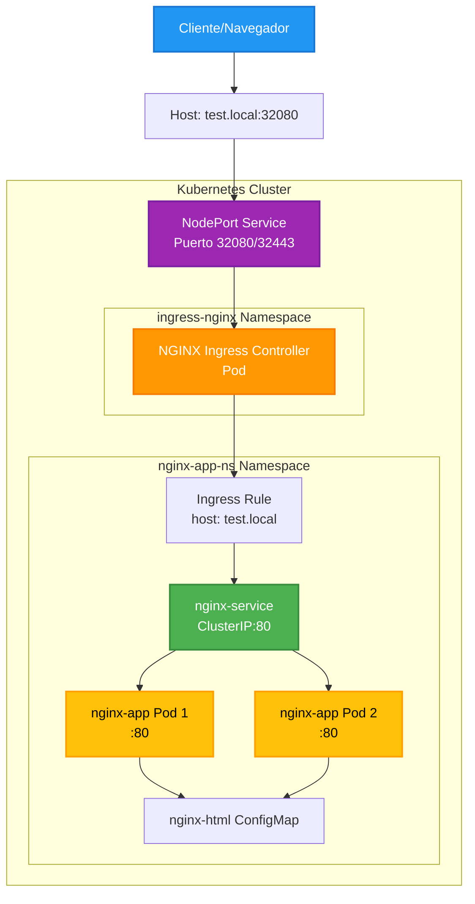
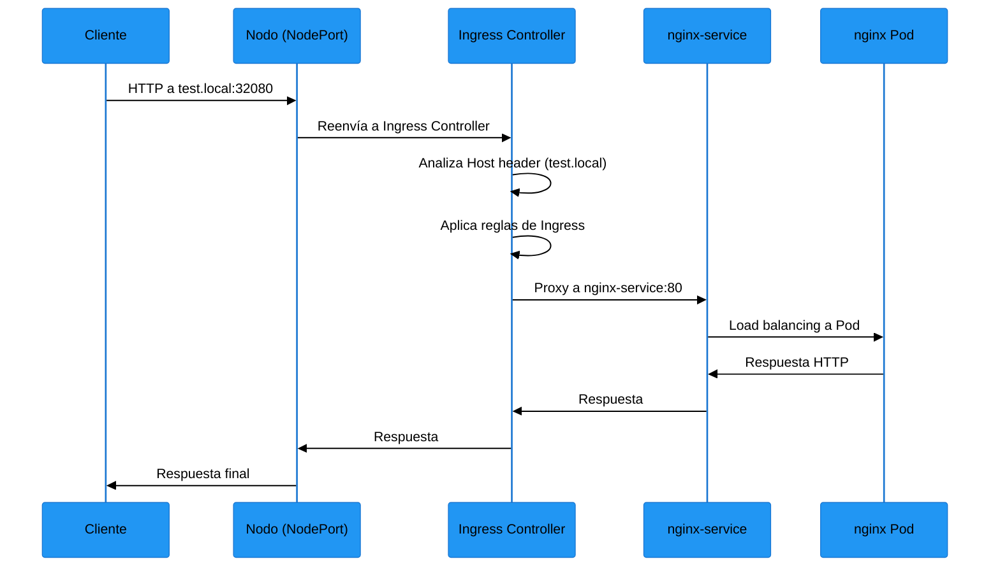

Cómo acceder a nginx-app a través del Ingress Controller
Configuración actual
Basándome en tus archivos, tu configuración está bien estructurada. Aquí te explico cómo funciona:

1. Acceso a la aplicación
Para acceder a tu aplicación nginx, necesitas:

```
echo "127.0.0.1 test.local" | sudo tee -a /etc/hosts
```

Configurar el host en tu máquina local:
Acceder a través del NodePort del Ingress Controller:
    HTTP: http://test.local:32080
    HTTPS: https://test.local:32443
2. Diagrama de la configuración



3. Cómo funciona la red en Kubernetes
Conceptos clave:
Pod Network: Cada Pod tiene su propia IP dentro del cluster
Service Network: Los Services proporcionan IPs estables para grupos de Pods
Node Network: La red física de los nodos del cluster
Tipos de Services:
ClusterIP (por defecto): Solo accesible dentro del cluster
NodePort: Expone el servicio en un puerto de cada nodo
LoadBalancer: Para clusters en cloud con load balancer externo
Flujo de red en tu configuración:


4. Componentes de red involucrados:
Ingress Controller (NGINX):

Actúa como proxy reverso
Lee las reglas de Ingress
Enruta tráfico basándose en host/path
Service (ClusterIP):

Proporciona load balancing
IP estable para los Pods
DNS interno: nginx-service.nginx-app-ns.svc.cluster.local
Pods:

Ejecutan la aplicación nginx
Cada uno tiene su IP única
Se registran automáticamente en el Service
5. Verificación
Esta configuración te permite acceder a tu aplicación nginx a través de un nombre de host limpio, mientras el Ingress Controller maneja el enrutamiento interno del cluster.